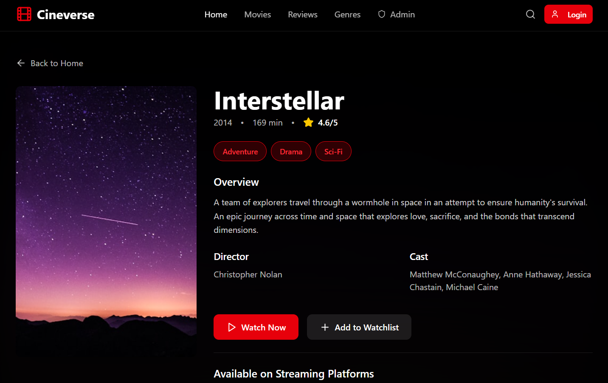
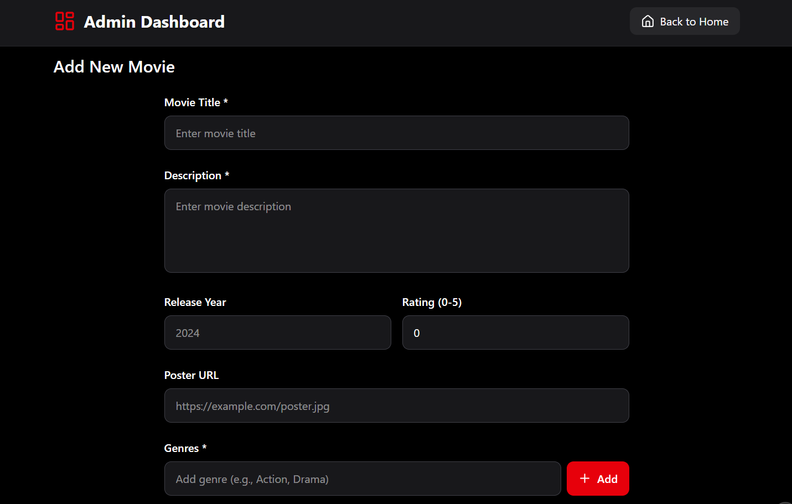
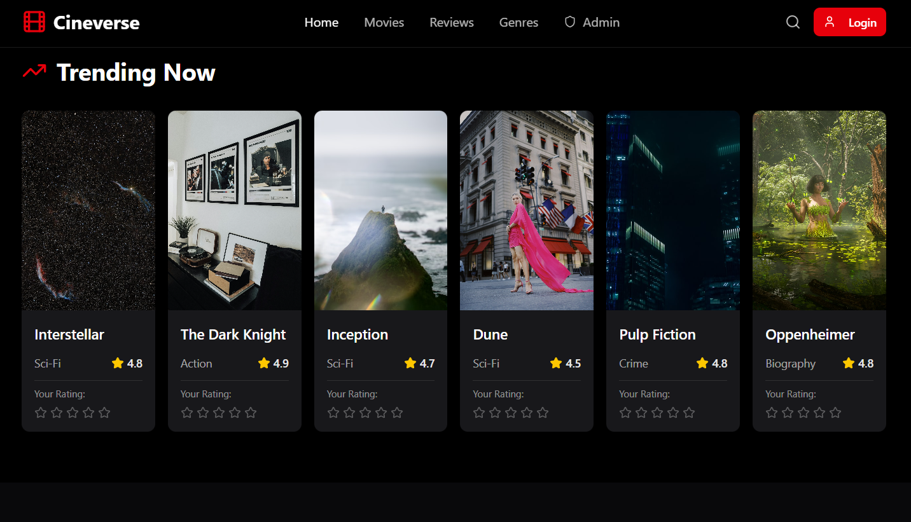
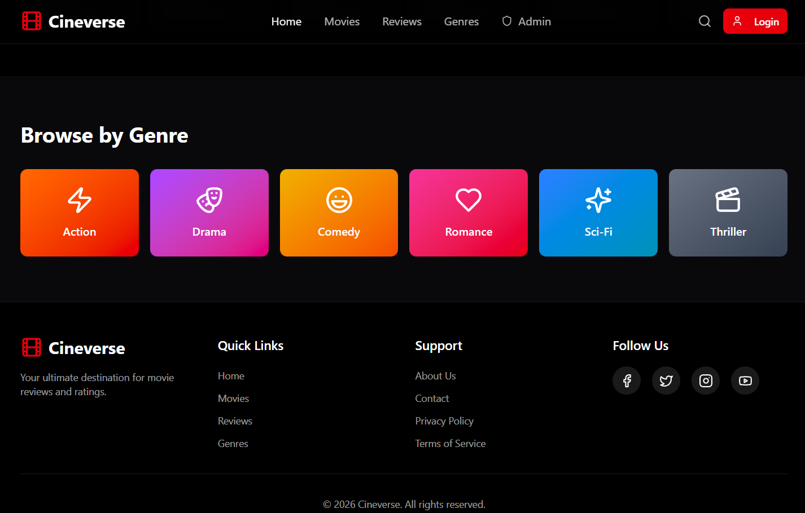
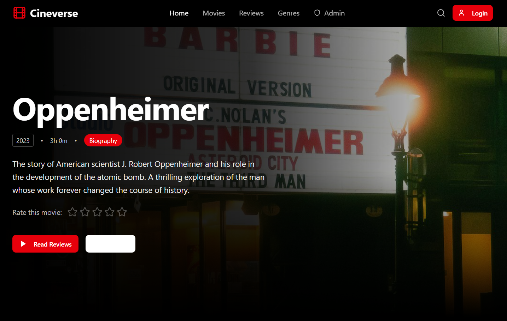

# 🎬 CineVerse - Full-Stack Movie Review CMS

> A modern, feature-rich movie review and content management system built with cutting-edge technologies.

[](https://opensource.org/licenses/MIT)
[](https://react.dev)
[](https://www.php.net)
[](https://www.mysql.com)
[](https://www.typescriptlang.org)
[](https://tailwindcss.com)

---

## 📸 Project Showcase

### 🏠 Home Page - Featured Movies & Trending Section


**Key Features:**
- ✨ Dynamic hero section with featured movie
- 🎬 Trending movies carousel
- 🔍 Search and filter functionality
- 📂 Category browsing
- 🎨 Modern dark theme UI
- 📱 Fully responsive design

---

### 🎥 Movie Details Page


**Key Features:**
- 📝 Complete movie information (director, cast, duration)
- ⭐ Star ratings and review system
- 💬 User reviews and comments
- 📺 Streaming platform availability
- ➕ Add to watchlist button
- 🎞️ Movie poster and backdrop images

---

### 👨💼 Admin Dashboard


**Key Features:**
- 📊 Dashboard statistics (total movies, users, reviews)
- 🎬 Movie management (add, edit, delete)
- 👥 User management
- 📂 Category management
- 📈 Analytics and insights
- 🔧 Admin controls and permissions

---

### 👤 User Profile & Watchlist


**Key Features:**
- 👤 User profile information
- 📋 Personal watchlist management
- ⭐ My reviews and ratings
- ✏️ Edit profile option
- 🔐 Password change
- 📊 User statistics

---

### 🔐 Login & Authentication


**Key Features:**
- 🔑 Secure login form
- 📝 Registration form
- 🔐 Password security
- ✅ Form validation
- 🎨 Modern UI design

---

### 🔍 Search & Filter Results


**Key Features:**
- 🔎 Search by title, director, cast
- 📂 Filter by category/genre
- 📅 Filter by year
- ⭐ Sort by rating
- 📊 Pagination
- 🎬 Movie grid display

---

## ✨ Key Features

### 🎥 Frontend Features
- **Modern UI** - Dark theme with responsive design using Tailwind CSS
- **Movie Discovery** - Browse, search, and filter movies by category
- **Featured Content** - Dynamic hero section with featured movies
- **Trending Section** - Carousel showcasing trending movies
- **Movie Details** - Comprehensive information with reviews and ratings
- **User Authentication** - Secure login/register system
- **Watchlist** - Save favorite movies for later
- **Review System** - Submit and manage movie reviews with star ratings
- **User Profiles** - Personalized user dashboard

### 🔧 Backend Features
- **RESTful API** - Clean, well-documented API architecture
- **Complete CRUD** - Full movie, review, and category management
- **Authentication** - Session-based user authentication
- **Role-Based Access** - User and Admin roles with permissions
- **File Uploads** - Handle posters, backdrops, and avatars
- **Review Aggregation** - Automatic rating calculations
- **Watchlist Management** - User-specific watchlist operations
- **Streaming Platforms** - Track movie availability across platforms
- **Admin Dashboard** - Statistics and management tools
- **Bulk Operations** - Batch operations for admins

---

## 🚀 Quick Start

### Prerequisites
- **XAMPP** (Apache + MySQL + PHP 8.0+)
- **Node.js** 18+ and npm/pnpm
- Modern web browser

### Installation

#### 1️⃣ Clone the Repository
```bash
git clone https://github.com/Venkata-Sai-Vishwas-Patnala/CineVerse-CMS-PHP.git
cd CineVerse-CMS-PHP
```

#### 2️⃣ Database Setup
```bash
# Start XAMPP and ensure Apache & MySQL are running
# Open phpMyAdmin: http://localhost/phpmyadmin

# Import the database schema
mysql -u root -p < backend/setup.sql
```

**Default Admin Credentials:**
- Email: `admin@cineverse.com`
- Password: `password`

#### 3️⃣ Frontend Setup
```bash
# Install dependencies
npm install

# Build for production
npm run build

# Or start development server
npm run dev
```

#### 4️⃣ Access the Application
- **Production**: http://localhost/
- **Development**: http://localhost:5173

---

## 📁 Project Structure

```
CineVerse/
├── 📂 backend/                    # PHP Backend
│   ├── 📂 api/                   # API Endpoints
│   │   ├── auth.php              # Authentication
│   │   ├── movies.php            # Movie CRUD & search
│   │   ├── reviews.php           # Review management
│   │   ├── categories.php        # Category management
│   │   ├── watchlist.php         # Watchlist operations
│   │   ├── upload.php            # File upload handling
│   │   └── admin.php             # Admin operations
│   ├── 📂 config/                # Configuration
│   │   ├── db.php                # Database connection
│   │   └── auth.php              # Authentication helpers
│   ├── index.php                 # API router
│   └── setup.sql                 # Database schema
│
├── 📂 src/                       # React Frontend
│   ├── 📂 app/
│   │   ├── 📂 components/        # Reusable components
│   │   ├── 📂 pages/             # Page components
│   │   ├── 📂 context/           # React Context
│   │   └── routes.tsx            # Route definitions
│   ├── 📂 lib/
│   │   └── api.ts                # API client
│   └── 📂 styles/                # CSS & Tailwind
│
├── 📂 public/
│   └── 📂 uploads/               # User uploads
│
├── .htaccess                     # Apache routing
├── vite.config.ts                # Vite configuration
└── package.json                  # Dependencies
```

---

## 🔌 API Documentation

### Authentication Endpoints
| Method | Endpoint | Description |
|--------|----------|-------------|
| POST | `/api/auth/register` | Register new user |
| POST | `/api/auth/login` | User login |
| POST | `/api/auth/logout` | User logout |
| GET | `/api/auth/me` | Get current user |
| PUT | `/api/auth/profile` | Update profile |
| PUT | `/api/auth/password` | Change password |

### Movie Endpoints
| Method | Endpoint | Description |
|--------|----------|-------------|
| GET | `/api/movies` | List movies (with filters) |
| GET | `/api/movies/featured` | Get featured movie |
| GET | `/api/movies/trending` | Get trending movies |
| GET | `/api/movies/{id}` | Get movie by ID |
| POST | `/api/movies` | Create movie (admin) |
| PUT | `/api/movies/{id}` | Update movie (admin) |
| DELETE | `/api/movies/{id}` | Delete movie (admin) |

### Review Endpoints
| Method | Endpoint | Description |
|--------|----------|-------------|
| GET | `/api/reviews?movie_id={id}` | List reviews |
| POST | `/api/reviews` | Create/update review |
| DELETE | `/api/reviews/{id}` | Delete review |

### Category Endpoints
| Method | Endpoint | Description |
|--------|----------|-------------|
| GET | `/api/categories` | List all categories |
| POST | `/api/categories` | Create category (admin) |
| PUT | `/api/categories/{id}` | Update category (admin) |
| DELETE | `/api/categories/{id}` | Delete category (admin) |

### Watchlist Endpoints
| Method | Endpoint | Description |
|--------|----------|-------------|
| GET | `/api/watchlist` | Get user's watchlist |
| POST | `/api/watchlist` | Add to watchlist |
| DELETE | `/api/watchlist/{movie_id}` | Remove from watchlist |

### Admin Endpoints
| Method | Endpoint | Description |
|--------|----------|-------------|
| GET | `/api/admin/stats` | Dashboard statistics |
| GET | `/api/admin/users` | List users |
| POST | `/api/admin/users` | Create user |
| PUT | `/api/admin/users/{id}` | Update user |
| DELETE | `/api/admin/users/{id}` | Delete user |

---

## 👥 User Roles & Permissions

### 👤 Regular User
- ✅ Browse and search movies
- ✅ View detailed movie information
- ✅ Submit and manage reviews
- ✅ Rate movies (1-5 stars)
- ✅ Create and manage watchlist
- ✅ Update profile information

### 👨💼 Admin User
- ✅ All user permissions
- ✅ Add/edit/delete movies
- ✅ Manage user accounts
- ✅ Manage categories and genres
- ✅ View dashboard statistics
- ✅ Manage streaming platforms
- ✅ Perform bulk operations

---

## 🛠️ Technology Stack

### Frontend
| Technology | Version | Purpose |
|-----------|---------|---------|
| React | 18 | UI framework |
| TypeScript | 5.0+ | Type safety |
| Vite | 6.0+ | Build tool |
| React Router | 7 | Routing |
| Tailwind CSS | 4.0 | Styling |
| shadcn/ui | Latest | Components |
| Lucide Icons | Latest | Icons |
| Sonner | Latest | Notifications |

### Backend
| Technology | Version | Purpose |
|-----------|---------|---------|
| PHP | 8.0+ | Server language |
| MySQL | 8.0+ | Database |
| PDO | Built-in | DB abstraction |
| bcrypt | Built-in | Password hashing |
| Apache | 2.4+ | Web server |

---

## 🔒 Security Features

- 🔐 **Password Hashing** - bcrypt for secure password storage
- 🛡️ **SQL Injection Prevention** - Prepared statements with PDO
- 🔑 **CSRF Protection** - Session-based tokens
- 📁 **File Validation** - Secure file upload handling
- 👮 **Role-Based Access Control** - Permission-based operations
- 🧹 **Input Sanitization** - Clean user inputs
- 🔒 **Session Security** - Secure session management
- 📝 **CORS Headers** - Proper cross-origin handling

---

## 📊 Database Schema

### Tables (8 Total)
- **users** - User accounts and profiles
- **movies** - Movie information
- **categories** - Movie genres
- **platforms** - Streaming platforms
- **reviews** - User reviews and ratings
- **watchlist** - User watchlist items
- **movie_categories** - Movie-category relationships
- **movie_platforms** - Movie-platform availability

### Pre-seeded Data
- 1 admin user
- 10 movie categories
- 5 streaming platforms
- 6 sample movies with relationships

---

## ⚙️ Configuration

### Database Configuration
Edit `backend/config/db.php`:
```php
define('DB_HOST', 'localhost');
define('DB_USER', 'root');
define('DB_PASS', '');
define('DB_NAME', 'cineverse');
```

### Environment Variables
Create `.env` file:
```env
VITE_API_URL=http://localhost
VITE_APP_NAME=CineVerse
```

---

## 🐛 Troubleshooting

### Database Connection Failed
- ✅ Ensure MySQL is running in XAMPP
- ✅ Check credentials in `backend/config/db.php`
- ✅ Verify `cineverse` database exists

### File Upload Errors
- ✅ Check folder permissions on `public/uploads/`
- ✅ Verify PHP `upload_max_filesize` in php.ini
- ✅ Ensure write permissions on upload directories

### API 404 Errors
- ✅ Verify `.htaccess` is in root directory
- ✅ Enable `mod_rewrite` in Apache
- ✅ Check Apache DocumentRoot configuration

### CORS Issues
- ✅ Verify Vite proxy in `vite.config.ts`
- ✅ Check backend CORS headers
- ✅ Ensure correct origin in requests

---

## 🚀 Deployment

### Production Build
```bash
npm run build
```

### Serve Production Build
```bash
# Copy dist/ contents to Apache root
# Access via http://localhost/
```

---

## 📄 License

This project is open source and available under the **MIT License**.

---

## 🤝 Contributing

Contributions, issues, and feature requests are welcome!

1. Fork the repository
2. Create your feature branch (`git checkout -b feature/AmazingFeature`)
3. Commit your changes (`git commit -m 'Add some AmazingFeature'`)
4. Push to the branch (`git push origin feature/AmazingFeature`)
5. Open a Pull Request

---

## 📧 Support

- **Issues**: [GitHub Issues](https://github.com/Venkata-Sai-Vishwas-Patnala/CineVerse-CMS-PHP/issues)
- **Author**: [Venkata Sai Vishwas Patnala](https://github.com/Venkata-Sai-Vishwas-Patnala)

---

## 🎉 Acknowledgments

- Built with ❤️ for movie enthusiasts
- Inspired by modern streaming platforms
- Thanks to all contributors

---

**Made with ❤️ by [Venkata Sai Vishwas Patnala](https://github.com/Venkata-Sai-Vishwas-Patnala)**

⭐ If you find this project helpful, please consider giving it a star!
